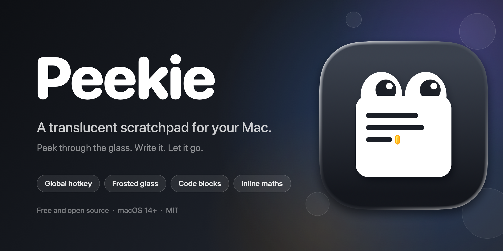

<p align="center">
  
</p>

<p align="center">
  <a href="https://github.com/maxbenschop/peekie/releases/latest"></a>
  <a href="https://github.com/maxbenschop/peekie/actions/workflows/ci.yml"></a>
  
  
  <a href="LICENSE"></a>
</p>

# Peekie

Peekie is a small, native scratchpad for macOS. Press a shortcut from anywhere and a translucent note floats over whatever you are doing. Type, calculate, paste a snippet, and close it when you are done. Notes are temporary by default, so nothing piles up.

It has no Dock icon, no accounts, no sync, and makes no network connections.

## Features

**Fast and out of the way**
- A global shortcut opens a new note from any app (`⌥Space`).
- Quick capture copies your current selection into a new note (`⌥⇧Space`).
- One shortcut hides or shows every note (`⌃⌥N`).
- Notes can stay on top of other windows, fade, or hide when you click away.
- No Dock icon. An optional menu bar icon is available.

**A note that looks like glass**
- Adjustable blur and background opacity, so the window behind the note stays readable.
- Light, dark, or follow the system.
- Respects Reduce Transparency, Increase Contrast and Reduce Motion.

**Good to write in**
- Bold, italic, underline and text colours.
- Bullets and checklists: type `- ` or `[] `, click a box to check it.
- Fenced code blocks with syntax colours for Swift, JavaScript and TypeScript, Python, shell, JSON, HTML, CSS, SQL, Go, Rust and C-style languages.
- Inline maths: type `12*3 =` at the end of a line and the answer appears.
- Paste or drag in images, and resize them from the right-click menu.
- Links open with `⌘`-click. Find with `⌘F`. Zoom each note with `⌘+` and `⌘-`.

**Keep or discard**
- Temporary by default: closing a note discards it, and `⇧⌘T` brings back the last closed one.
- Optionally save open notes between launches.
- Save or export a note as `.txt`, `.md`, `.rtf` or `.rtfd`, share it, or print it.

## Install

1. Download the latest `Peekie-x.y.z.dmg` from the [Releases page](https://github.com/maxbenschop/peekie/releases/latest).
2. Open it and drag **Peekie** onto **Applications**.
3. Open Peekie from Applications. The Settings window opens the first time.

**Requirements:** macOS 14 Sonoma or later, Apple Silicon or Intel. Peekie is developed on the newest macOS. Earlier versions should work but get less testing, so please report anything odd.

### "Peekie can't be opened"

Release builds are not notarized yet, because that needs a paid Apple Developer ID. macOS therefore asks you to confirm the first launch:

1. Right-click **Peekie** in Applications and choose **Open**, then click **Open** again.
2. If macOS still refuses, open **System Settings > Privacy & Security** and click **Open Anyway**.
3. Or run this in Terminal: `xattr -dr com.apple.quarantine /Applications/Peekie.app`

You only need to do this once. Every release lists a SHA-256 checksum so you can verify the download, and you can always [build it yourself](#build-from-source).

## Using Peekie

### Shortcuts

Global shortcuts work from any app and can be changed in Settings.

| Shortcut | Action |
| --- | --- |
| `⌥Space` | New note |
| `⌥⇧Space` | Quick capture the current selection into a new note |
| `⌃⌥N` | Show or hide all notes |

Inside a note:

| Shortcut | Action |
| --- | --- |
| `⌘W` | Close and discard the note |
| `⇧⌘T` | Reopen the last closed note |
| `⌥⌘T` | Keep the note on top |
| `⇧⌘C` | Copy everything and close |
| `⌘S` / `⌘P` | Save or export / print |
| `⌘B` `⌘I` `⌘U` | Bold, italic, underline |
| `⌃⌘1` to `⌃⌘8` | Text colours |
| `⌘+` `⌘-` `⌘0` | Bigger, smaller, actual size |
| `⌘F` | Find |
| `⌘N` | New note |

Several of these can be rebound in **Settings > Shortcuts**.

### Getting to Settings and quitting

Peekie has no Dock icon, so open **Settings** by launching Peekie again from Applications, Spotlight or Finder. While Settings is open, the menu bar shows the Peekie menu, where `⌘,` and `⌘Q` work. If you turn on **Show menu bar icon**, it has entries for Settings and Quit.

### Settings

Launch at login, keep notes on top, save notes between launches, menu bar icon, behaviour when you click away, all shortcuts, light or dark mode, background opacity, blur, font and font size.

## Privacy and permissions

- Peekie makes **no network connections**, has **no analytics**, and stores nothing outside your Mac.
- **Accessibility** access is requested only for quick capture. It sends `⌘C` to the frontmost app to read your selection, then restores your clipboard. Everything else works without it.
- If you turn on **Save notes between launches**, notes are written **unencrypted** to `~/Library/Application Support/Peekie/Notes`. Closing a note deletes its saved copy. Turning the setting off deletes them all.
- The adjustable blur uses internal Core Animation layers of the system blur view, which is not a public API. Peekie falls back to a plain fade of the standard blur if a future macOS changes it, and it is why Peekie is not on the Mac App Store. See [docs/ARCHITECTURE.md](docs/ARCHITECTURE.md).

## Build from source

You need macOS 14 or later and **Xcode 26 or later** (the app icon is built with Icon Composer).

```sh
git clone https://github.com/maxbenschop/peekie.git
cd peekie
./scripts/install.sh
```

`install.sh` builds a Release app, installs it to `/Applications` and launches it. It signs with your Apple Development certificate when you have one, which keeps the Accessibility permission across rebuilds. Without a certificate it signs ad hoc, and macOS asks you to grant Accessibility again after every rebuild.

Other scripts:

| Script | What it does |
| --- | --- |
| `scripts/make-dmg.sh` | Builds a universal (Apple Silicon and Intel) app and packages `dist/Peekie-<version>.dmg` |
| `scripts/test.sh [logic\|editor\|window\|all]` | Compiles and runs the test suites |
| `scripts/make-assets.sh` | Regenerates the icon PNG and the README banner |

## Contributing

Contributions are welcome, from a typo fix to a new feature. Read [CONTRIBUTING.md](CONTRIBUTING.md) for the setup, the checks to run and what makes a good pull request. [docs/ARCHITECTURE.md](docs/ARCHITECTURE.md) explains how the code fits together and why some things are done the way they are. Please follow the [code of conduct](CODE_OF_CONDUCT.md).

Good places to start:
- Screenshots and a demo GIF for this README.
- More languages for code block highlighting.
- Localization. Peekie is English only.
- VoiceOver and keyboard navigation improvements.

## Roadmap

Ideas, not promises:
- Notarized releases and a Homebrew cask.
- Automatic updates.
- Optional sync between Macs.
- A note list with search, for people who save notes.
- Markdown rendering.

## FAQ

**Why is there no Dock icon?** Peekie is a background utility. It is meant to appear when you press a shortcut and disappear when you are done.

**Can I keep my notes?** Yes. Turn on **Save notes between launches**, or export a note with `⌘S`.

**Peekie asks for Accessibility again after I rebuilt it.** macOS ties the permission to the app's code signature. Build with an Apple Development certificate installed, and it will stay granted.

**Is there a Windows or Linux version?** No. Peekie is built with AppKit and SwiftUI for macOS.

## License

[MIT](LICENSE) © Max Benschop
